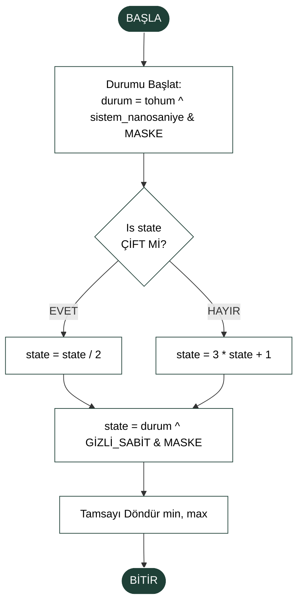

# Collatz-XOR Hybrid (CXH) Rastgele Sayı Üreteci

Bu proje, **Collatz Sanısı** (Collatz Conjecture) ve **XOR** operatörünü birleştiren hibrit bir rastgele sayı üretim algoritması sunmaktadır (PRNG - Pseudo Random Number Generator).

## 1. Akış Şeması
Algoritmanın çalışma mantığı aşağıdaki akış şemasında gösterilmiştir:



## 2. Sözde Kod (Pseudocode)

Algoritmanın adım adım çalışma prensibi:

```text
BAŞLA
    SAYI = (Kullanıcı_Tohumu XOR Sistem_Saati)

    FONKSİYON Sayı_Üret:
        EĞER SAYI çiftse: SAYI = SAYI / 2
        DEĞİLSE: SAYI = (SAYI * 3) + 1

        SAYI = SAYI XOR GİZLİ_SABİT
        SAYI = SAYI'yı 48-bit ile sınırla

        ÇIKTI = (SAYI modulo İSTENEN_ARALIK)
        DÖNDÜR ÇIKTI
    BİTİR
```

## 3. Programlama Kodu

Python dili ile gerçekleştirilmiş örnek uygulama:

```python
import time

class OzelUretec:
    def __init__(self, seed):
        # Başlangıçta tohumu nano saniye ile harmanlıyoruz (Tahmin edilemezlik)
        self.state = (seed ^ time.time_ns()) & ((1 << 48) - 1)
        self.magic = 0x5DEECE66D # Bu bizim gizli sosumuz

    def uret(self, alt_sinir, ust_sinir):
        # Collatz kuralı
        if self.state % 2 == 0:
            self.state //= 2
        else:
            self.state = 3 * self.state + 1
        
        # Bitleri birbirine katıyoruz
        self.state = (self.state ^ self.magic) & ((1 << 48) - 1)
        
        # Kullanıcının istediği aralığa oturtuyoruz
        return alt_sinir + (self.state % (ust_sinir - alt_sinir + 1))

# DENEME
test = OzelUretec(seed=123)
print("Senin İçin Üretilen Sayılar:")
for i in range(5):
    print(f"{i+1}. Sayı: {test.uret(1, 100)}")
```

## 4. Örnek Çıktı

Kodu çalıştırdığınızda elde edeceğiniz örnek terminal çıktısı:

```text
Senin İçin Üretilen Sayılar:
1. Sayı: 36
2. Sayı: 60
3. Sayı: 44
4. Sayı: 8
5. Sayı: 32
```
